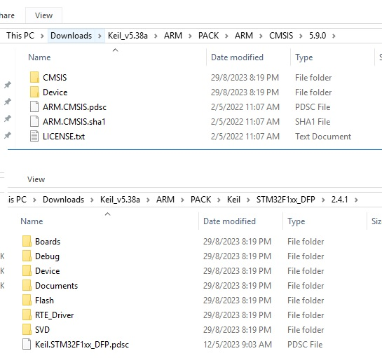

EIE3105_Lab5
=============

### Required dependencies
- https://www.keil.com/pack/Keil.STM32F1xx_DFP.2.4.0.pack
  - `7z x Keil.STM32F1xx_DFP.2.4.0.pack -o"Keil\STM32F1xx_DFP\2.4.0"`
- https://www.keil.com/pack/ARM.CMSIS.5.9.0.pack
  - `7z x ARM.CMSIS.5.9.0.pack -o"ARM\CMSIS\5.9.0"`

### Optional / Potential dependencies
- https://www.keil.com/pack/Keil.MDK-Middleware.7.16.0.pack
- https://www.keil.com/pack/Keil.MDK-Middleware_Graphics.1.3.0.pack
- https://www.keil.com/pack/ARM.CMSIS-NN.4.1.0.pack
- https://www.keil.com/pack/ARM.CMSIS-DSP.1.15.0.pack
